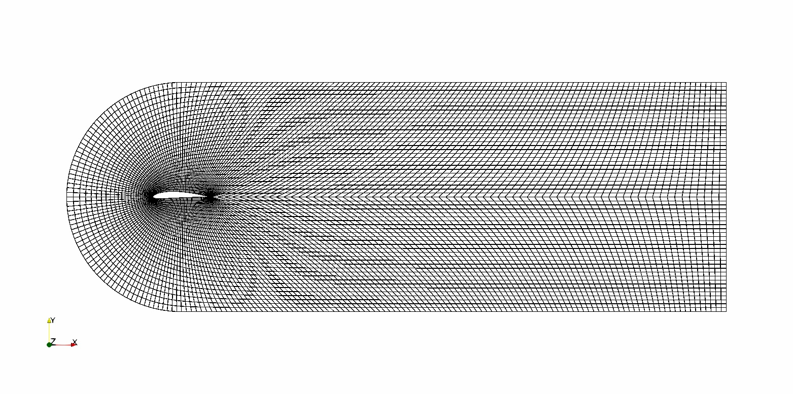

# EllipticalPAN

is a mesh generator based on elliptic partial differential equation.  
Generate a C type mesh as bellow.



This is a header only library.

## CI

|                                                                                 Status                                                                                 |    Environment     |
| :--------------------------------------------------------------------------------------------------------------------------------------------------------------------: | :----------------: |
| [](https://github.com/PANFACTORY/EllipticalPAN/actions/workflows/cmake.yml) | ubuntu-latest(g++) |


## Example

The above mesh is generated from `sample/main.cpp` .

`cd sample`, build and run with this command, then you can get `mesh.vtk` (VTK format result file) .

```
clang++ -O3 ./main.cpp
./a.exe
```

## Document
- [Document](https://panfactory.github.io/EllipticalPAN/)

## Dependency
- Google Test
- Doxygen

## License
- [MIT](https://github.com/PANFACTORY/EllipticalPAN/blob/main/LICENSE)
